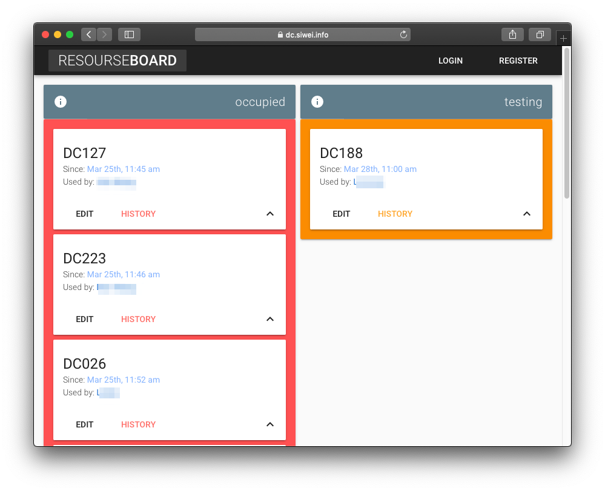
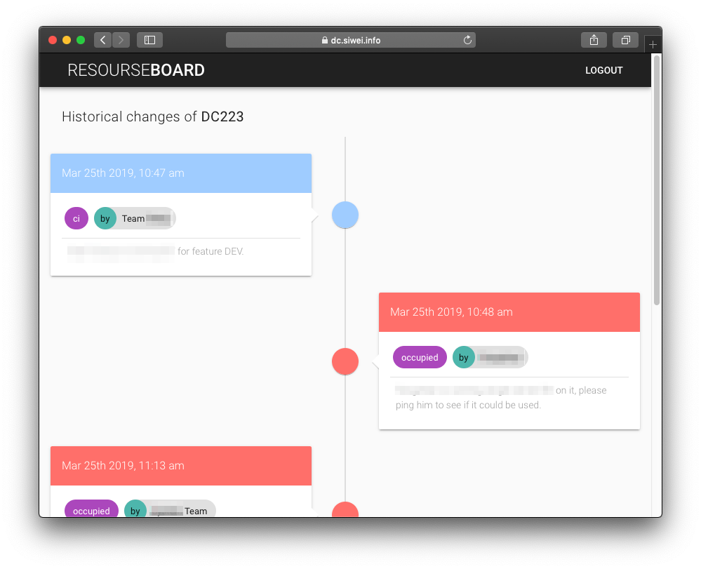
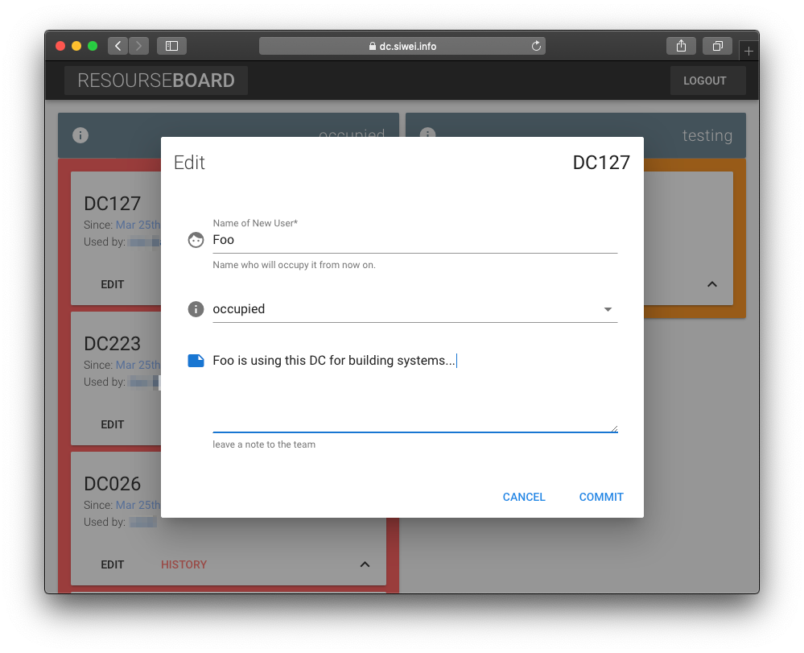
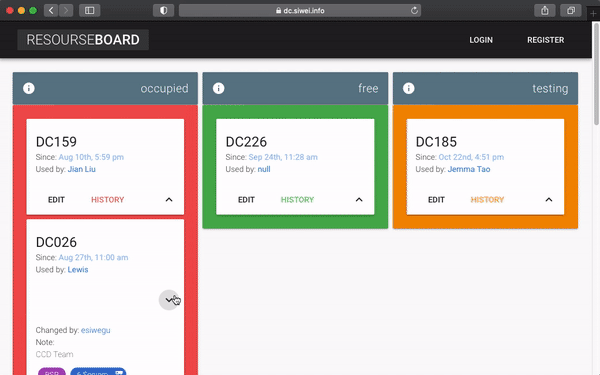

> 
>
> referring to blog on this project: <https://note.siwei.info/project-resource-board-a-scalable-webapp-with-flask-socketio-and-vue-js/>


## arch digram


> Arch designed as below, which is inspired by [Flack](https://github.com/miguelgrinberg/flack)


## prototpying

Created with `Balsamiq Mockups`, an animation was created [here](https://note.siwei.info/project-resource-board-a-scalable-webapp-with-flask-socketio-and-vue-js/demo-board-history.mp4) as well :-) .


```bash
resource-board ❯ tree prototype
prototype
├── board.bmpr
├── board.pdf
└── demo-board-history.mp4
```


## web-client

> Single-page web client created with Vue.js .

Board Portal Page:



Resource History Page:



Resource Edit Card:



Demo screen capture:



```bash
cd client
npm install
npm run build
```


## backend

> RESTful and SocketIO server created with Flask-Socket.IO .

```bash
cp backend/.env-example backend/.env
cd backend
vim .env # edit configurations
python server.py
```

